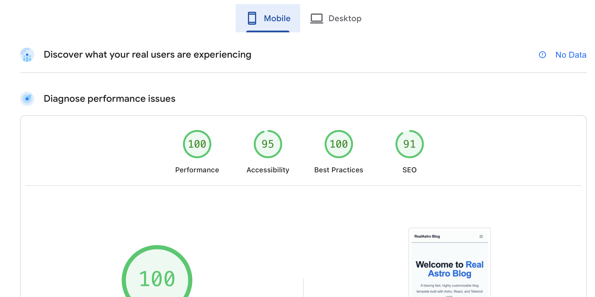
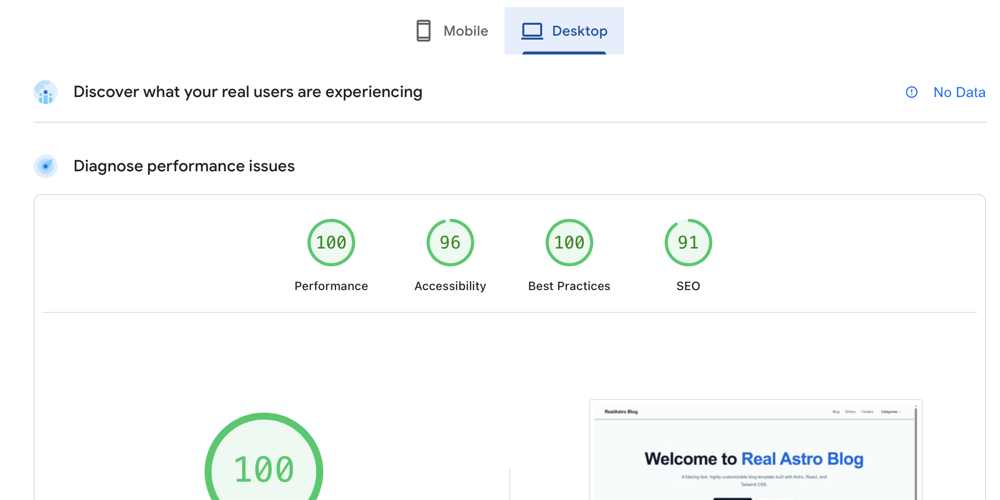

# Real Astro Blog Theme

A blazing fast, highly customizable blog template built with Astro, React, and Tailwind CSS.

🔗 **Live Demo:** [https://real-astro-blog.pages.dev](https://real-astro-blog.pages.dev)

## 🚀 Getting Started

To create a new Astro project using this theme, run the following command in your terminal.

```sh
npm create astro@latest my-blog-project -- --template savankoradia/real-astro-blog
```

Next, navigate into your new project directory and start the development server:

```sh
cd my-blog-project
npm install
npm run dev
```

## 🚀 Project Structure

Inside of your Astro project, you'll see the following folders and files:

```text
/
├── public/                # Static assets (images, icons, etc.)
├── src/
│   ├── components/        # Reusable Astro and React components (Navbar, Footer, Cards)
│   ├── content/           # Your markdown content collections
│   │   ├── blog/          # Blog post markdown files
│   │   └── writers/       # Author profile markdown files
│   ├── layouts/           # Global layout components wrapping your pages
│   ├── pages/             # Dynamic and static routing (Blog, Categories, Contact, etc.)
│   ├── styles/            # Global CSS and Markdown typography styles
│   └── config.ts          # Central configuration file for the site
└── package.json
```

Astro looks for `.astro` or `.md` files in the `src/pages/` directory. Each page is exposed as a route based on its file name.

There's nothing special about `src/components/`, but that's where we like to put any Astro/React/Vue/Svelte/Preact components.

Any static assets, like images, can be placed in the `public/` directory.

## ✨ Features & Configuration

This template is designed to be highly customizable. All core site-wide settings are centralized in the `src/config.ts` file, making it incredibly easy to tailor the blog to your needs.

You can easily configure the following features:

- **Site Details:** Update the `SITE_TITLE` and `SITE_DESCRIPTION` to automatically apply your brand's global SEO and meta information across the entire site.
- **Formunify Integrations:** Seamlessly collect leads and messages. Just drop in your Formunify.com form IDs for the `NEWSLETTER_FORM_ID` and `CONTACT_FORM_ID`.
- **Blog Pagination:** Control exactly how many articles appear on your blog feed at a time by adjusting the `POSTS_PER_PAGE` limit.
- **Custom Navigation:** Easily manage your main header menu (`NAV_LINKS`) and footer menu (`FOOTER_LINKS`), including support for external URLs.

## 🧞 Commands

All commands are run from the root of the project, from a terminal:

| Command                   | Action                                           |
| :------------------------ | :----------------------------------------------- |
| `npm install`             | Installs dependencies                            |
| `npm run dev`             | Starts local dev server at `localhost:4321`      |
| `npm run build`           | Build your production site to `./dist/`          |
| `npm run preview`         | Preview your build locally, before deploying     |
| `npm run astro ...`       | Run CLI commands like `astro add`, `astro check` |
| `npm run astro -- --help` | Get help using the Astro CLI                     |

## Performance
This theme is heavily optimized for speed and achieves very high PageSpeed Insights scores out of the box.




## 👀 Want to learn more?

Feel free to check [Astro's documentation](https://docs.astro.build) or jump into [Astro's Discord server](https://astro.build/chat).
